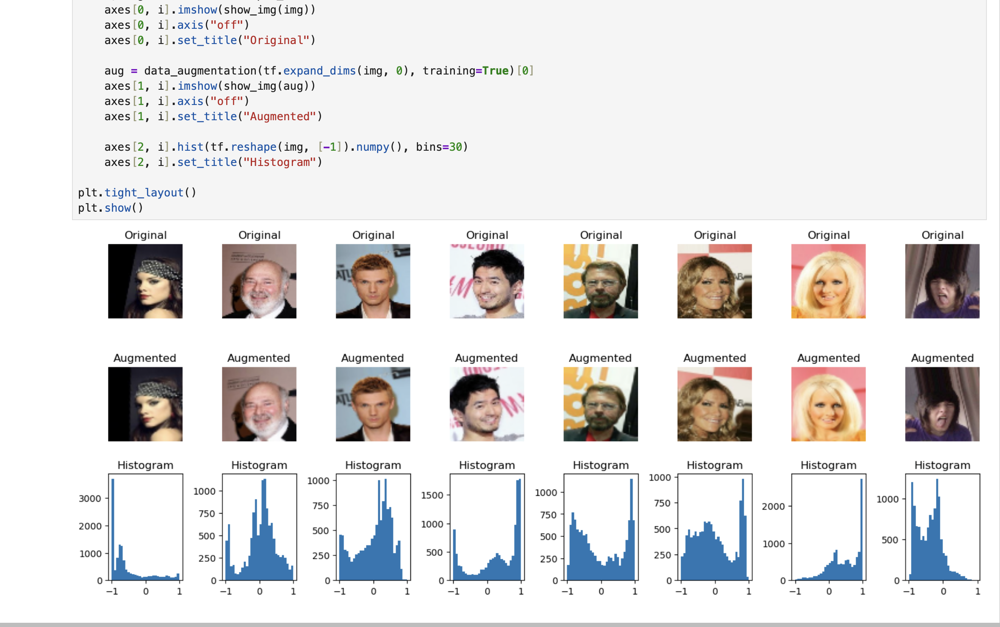
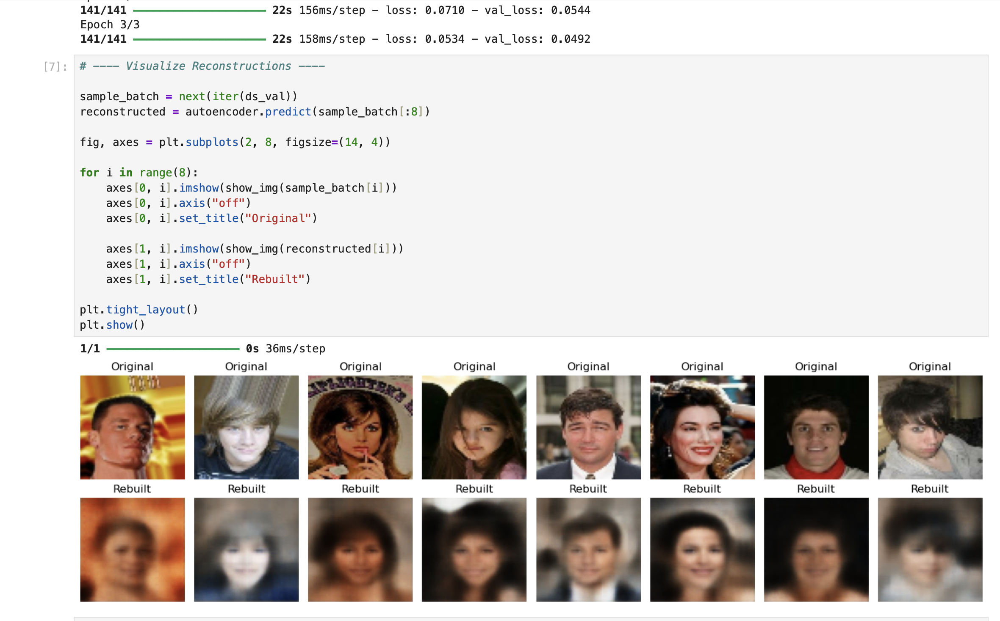
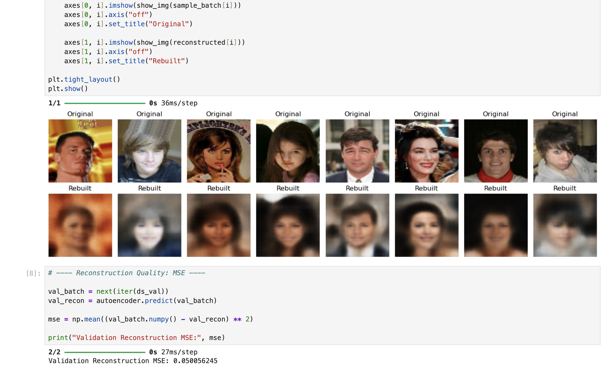
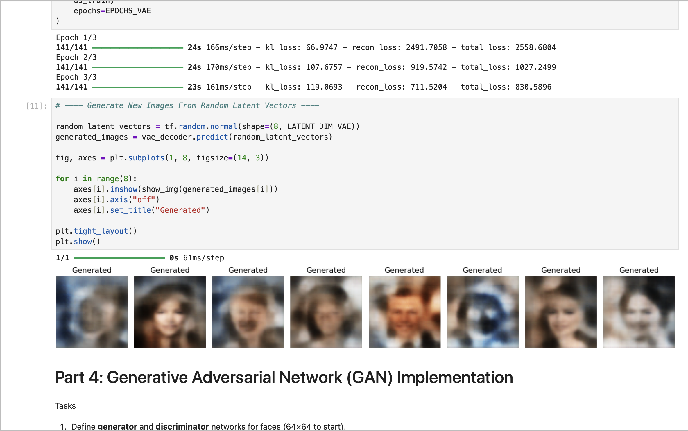

# Autoencoders-Generative-Deep-Learning
Deep learning project exploring autoencoders and generative models for representation learning, reconstruction, and unsupervised neural network analysis.
# Autoencoders-Generative-Deep-Learning
---
Deep learning project exploring Autoencoders (AE), Variational Autoencoders (VAE), and Generative Adversarial Networks (GANs) for representation learning, image reconstruction, latent space modeling, and generative artificial intelligence.

---

## Overview

This project explores generative deep learning using Autoencoders, Variational Autoencoders, and Generative Adversarial Networks.

Using the TensorFlow/Keras CelebA facial image dataset, the project investigates:

- Image preprocessing and augmentation
- Representation learning
- Image reconstruction
- Latent space sampling
- Probabilistic generative modeling
- Adversarial image synthesis
- Deep neural network generative workflows

The notebook demonstrates multiple approaches to unsupervised and generative learning using modern deep learning architectures.

---

## Project Objectives

The objectives of this project include:

- Build an Autoencoder for image compression and reconstruction.
- Implement a Variational Autoencoder (VAE) for latent probabilistic modeling.
- Develop a Generative Adversarial Network (GAN) for synthetic image generation.
- Analyze reconstruction quality and generative performance.
- Explore deep learning approaches for unsupervised representation learning.
- Compare generative architectures across reconstruction and image synthesis tasks.

---

## Technologies Used

### Programming Language
- Python

### Deep Learning Libraries
- TensorFlow
- Keras

### Data Science Libraries
- NumPy
- Matplotlib
- TensorFlow Datasets (TFDS)
- Scikit-learn

### Deep Learning Concepts
- Autoencoders
- Variational Autoencoders (VAE)
- Generative Adversarial Networks (GAN)
- Latent Space Learning
- Image Reconstruction
- Adversarial Learning
- Unsupervised Learning

---

## Visualizations

### Dataset Visualization

Illustrates CelebA dataset preprocessing, augmentation strategies, and pixel intensity distribution analysis.



### Autoencoder Reconstructions

Comparison between original validation images and reconstructed outputs generated by the autoencoder.



### Reconstruction Quality Results

Validation reconstruction performance using Mean Squared Error (MSE).



### GAN Generated Images

Synthetic face generation using adversarial training between generator and discriminator models.



---

## Dataset

This project uses the TensorFlow Datasets CelebA facial image dataset.

Dataset source:

```python
tensorflow_datasets (tfds) — celeb_a
```

Dataset Characteristics:

- Dataset: CelebA Faces
- Image Type: Facial Images
- Resolution: 64 × 64
- Learning Type: Unsupervised / Generative Deep Learning

The dataset is downloaded programmatically during notebook execution; therefore no local dataset files are required in the repository.

---

## Final Model Performance

### Models Implemented

- Autoencoder (AE)
- Variational Autoencoder (VAE)
- Generative Adversarial Network (GAN)

### Autoencoder (AE)

- Validation Reconstruction MSE: **0.0501**
- Dataset: CelebA Faces
- Resolution: 64 × 64
- Task: Image Reconstruction

### Variational Autoencoder (VAE)

- Latent Space Sampling Enabled
- Reconstruction + KL Divergence Optimization
- Task: Probabilistic Generative Modeling

### Generative Adversarial Network (GAN)

- Synthetic Face Image Generation
- Generator + Discriminator Adversarial Training
- Task: Generative Image Modeling

---

## Repository Structure

```text
Autoencoders-Generative-Deep-Learning/
│
├── notebooks/
│   └── Autoencoders Generative Models.ipynb
│
├── visuals/
│   ├── dataset_visualization.png
│   ├── autoencoder_reconstructions.png
│   ├── reconstruction_quality_results.png
│   └── gan_generated_images.png
│
├── data/
│   └── .gitkeep
│
├── README.md
└── requirements.txt
```

---

## Installation & Execution

Clone repository:

```bash
git clone https://github.com/Dare215/Autoencoders-Generative-Deep-Learning.git
```

Install dependencies:

```bash
pip install -r requirements.txt
```

Run notebook:

```bash
jupyter notebook
```

---

## Future Improvements

Future enhancements may include:

- Increase training epochs and perform hyperparameter tuning.
- Improve GAN image fidelity and adversarial training stability.
- Experiment with larger latent dimensions for richer feature representation.
- Implement Conditional GAN (cGAN) architectures.
- Compare performance against diffusion models and modern generative frameworks.
- Add FID (Fréchet Inception Distance) evaluation metrics.
- Add SSIM reconstruction metrics for image quality assessment.
- Deploy generative inference workflows using Streamlit.
- Investigate anomaly detection applications using latent embeddings.
- Explore transfer learning strategies for generative computer vision tasks.

---

## Applications

Potential real-world applications include:

- AI-Generated Image Synthesis
- Medical Imaging Reconstruction
- Biometric Data Modeling
- Image Compression Systems
- Deepfake Detection Research
- Computer Vision Research
- Biotech & Healthcare AI Image Analysis
- Representation Learning Systems

---

## Author

### Darious Brown  
PhD Candidate — Artificial Intelligence & Machine Learning

Areas of Interest:

- Deep Learning
- Generative AI
- Computer Vision
- Sequence Modeling
- Predictive Analytics
- Biotech AI Applications
- AI-Driven Operational Intelligence

Portfolio:  
https://dare215.github.io/DariousBrown-Portfolio/

LinkedIn:  
https://www.linkedin.com/in/dariousbrown

---
